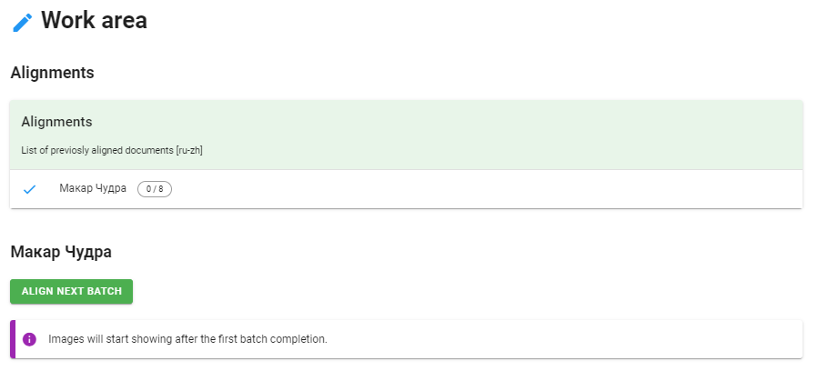
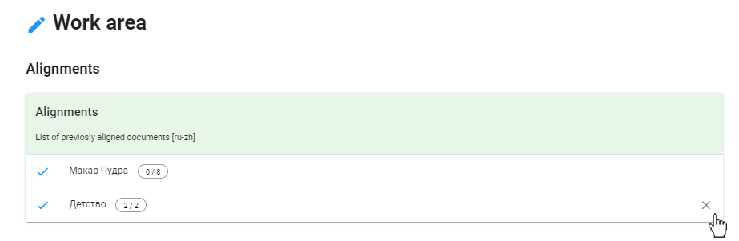
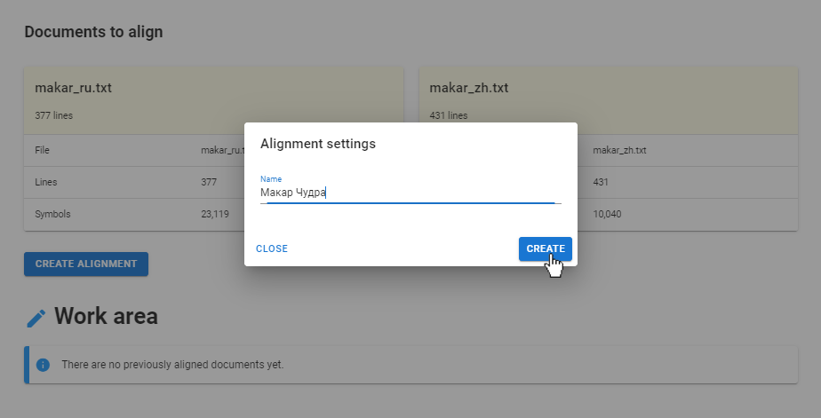

.. _create-alignment:

Создание выравнивания
=====================

Для создания выравнивания выберите пару загруженных ранее документов на разных языках и нажмите на кнопку **Create alignment**.
Появится диалоговое окно, в котором необходимо ввести название для выравнивания.

Нажмите кнопку **Create**. В секции Work area появится новое выравнивание. Программа автоматически разбивает тексты на части по 50 строк – батчи. Два числа через дробь справа от названия выравнивания показывают, на сколько батчей разбит текст и сколько из них уже выровнено. В нашем примере рассказ Максима Горького «Макар Чудра» разбит на 8 батчей, из них сейчас выровнено 0.

При работе с несколькими парами текстов для каждой пары можно создавать отдельное выравнивание. Чтобы выбрать нужное выравнивание, достаточно просто щелкнуть по нему. Чтобы удалить созданное выравнивание, нужно нажать на значок крестика, который появляется при наведении курсора.

Чтобы выровнять первую часть, нажмите кнопку **Align next batch**. Отредактируйте первый батч в секции :ref:`Edit <edit>` и нажмите кнопку Align next batch, чтобы начать работу со следующей частью. Переходите от батча к батчу, пока не отредактируете корпус целиком.

