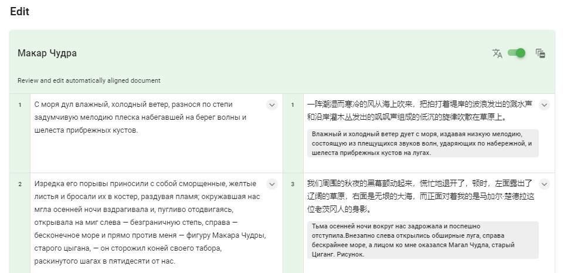
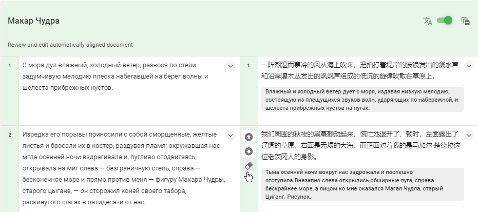
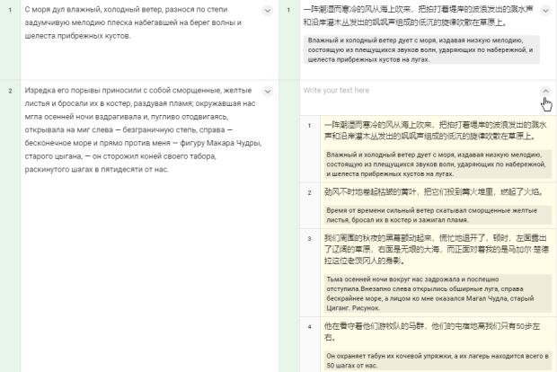
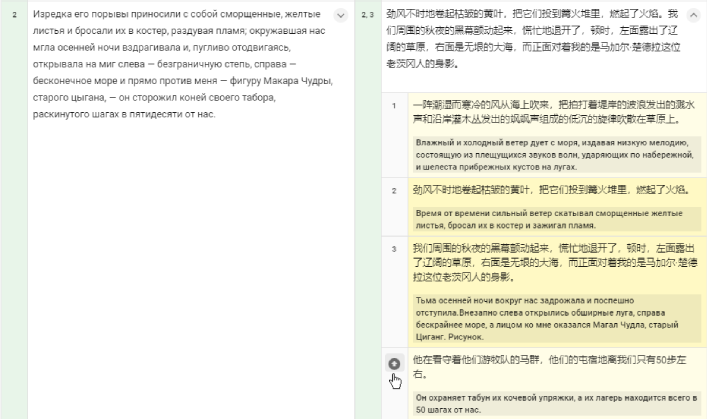
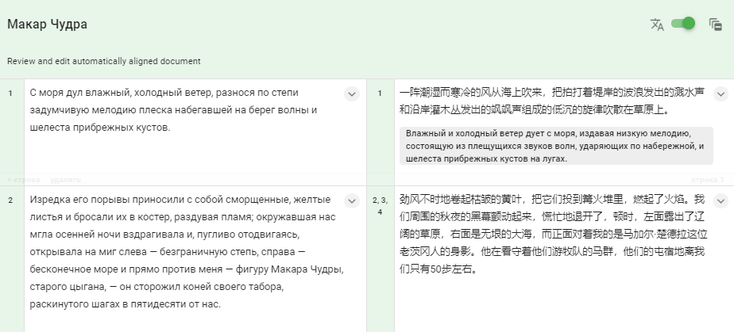
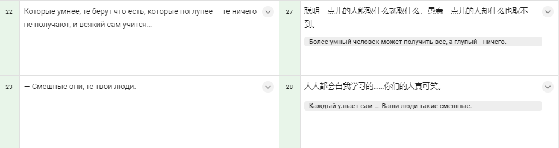
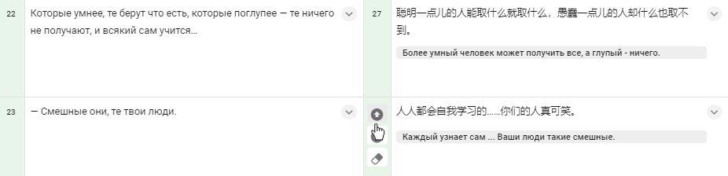
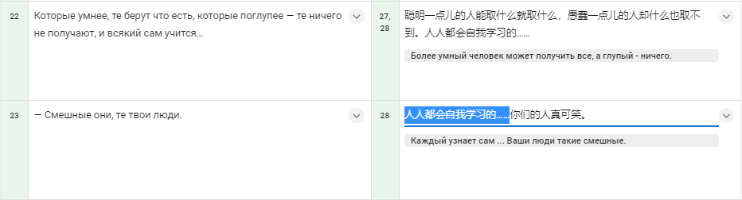

.. _edit:

Редактирование
==============

Непосредственная работа с текстами ведется после создания выравнивания (ссылка на раздел) в секции Edit. Область редактирования представляет собой таблицу с двумя колонками: в левой колонке по порядку расположены предложения текста на исходном языке, а в правой программа автоматически подбирает к ним наиболее подходящие кусочки текста на языке перевода. Числа слева от ячеек указывают на порядковый номер предложения в тексте. В нашем примере программа сопоставила первое русское предложение с первым китайским, а для второго предложения русского текста подобрала третье предложение китайского текста как наиболее подходящее.

  ..

**Изображение 1**

Процесс выравнивания
--------------------

В ходе ручного выравнивания текстов необходимо проверить, правильно ли программа сопоставила пары предложений и, если нужно, внести изменения. Редактирование производится с помощью нескольких кнопок:

+-----------+---------------------------------------------------------------------+
| Кнопка    | Описание                                                            |
+===========+=====================================================================+
||icon1|    | скопировать в предыдущую строку/добавить к текущей строке           |
+-----------+---------------------------------------------------------------------+
||icon2|    | скопировать в следующую строку                                      |
+-----------+---------------------------------------------------------------------+
||icon3|    | удалить содержание ячейки                                           |
+-----------+---------------------------------------------------------------------+
||icon4|    | добавить строку                                                     |
+-----------+---------------------------------------------------------------------+
||icon5|    | удалить строку                                                      |
+-----------+---------------------------------------------------------------------+

Рассмотрим несколько примеров.

В этом примере первая пара предложений сопоставлена правильно, а вот второе русское предложение переведено на китайский не полностью – не хватает частей «Изредка его порывы приносили с собой сморщенные, желтые листья и бросали их в костер, раздувая пламя» и «он сторожил коней своего табора, раскинутого шагах в пятидесяти от нас». (Изображение 1) Чтобы добавить недостающие кусочки, для начала очистим всю ячейку целиком. Наведите курсор на номер предложения: появятся три значка – стрелка вверх, стрелка вниз и ластик. Нажмите на ластик, чтобы очистить ячейку.

Теперь нажмем на стрелку в правой части ячейки. Откроется список кандидатов – предложений,расположенных в тексте рядом с текущим.

Мы видим, что в ячейку нужно поместитьпредложения №2, №3 и №4. Чтобы поместить предложение в предыдущую ячейку, наведите курсор наномер предложения и нажмите на значок стрелки, указывающей вверх. Поместите предложения №2, №3 и№4 по порядку.

Закройте список кандидатов, нажав на стрелку в правой частиячейки; строка готова.

В следующем примере в строке №27 китайского текста не хватает части «и всякий сам учится…»: этот кусочек попал в строку №28.

Удобнее всего будет добавить строку №28 к строке №27 и стереть лишнюю часть. Чтобы добавить строку к предыдущей, наведите курсор на номер строки и нажмите на стрелку вверх.

Теперь осталось только стереть лишнее в обеих строках. Текст в ячейках можно стирать, допечатывать, копировать и вставлять, как в обычном текстовом редакторе.

В следующем примере в русскую строку №120 попало сразу несколько предложений, потому что в оригинальном документе не были проставлены точки. Строку нужно разбить на отдельные предложения. Для этого наведите курсор на нижнюю часть ячейки: появятся кнопки «+ строка» и «удалить», а также номер строки. (Изображение 9) Добавим две строки и скопируем содержание строки №120 в каждую из них, нажав на стрелку вниз. (Изображение 10) Затем удалим лишнее в каждой из ячеек и подберем к ним китайские соответствия. (Изображение 11). При необходимости строки также можно удалять, нажав на кнопку «удалить» в нижней части строки.

Таким образом переходите от строки к строке, пока не отредактируете весь текст. Программа показывает по 10 строк на одной странице. В нижней части области редактирования расположены номера страниц. Текущая страница подсвечивается синим; чтобы перейти на нужную страницу, просто нажмите на ее номер или воспользуйтесь стрелками. Кнопка Go to позволяет быстро перейти к той или иной странице. К примеру, Вам нужно просмотреть строку №141 исходного текста; она находится на странице 15. Нажмите кнопку Go to, введите число 15 и нажмите Go. (Изображение 12)

«Потерянные» строки
-------------------

В процессе выравнивания искать несоответствия удобнее всего по номерам строк в левой колонке. Ищите пропущенные номера: например, здесь после строки №226 сразу идет строка №228 – очевидно, что строка №227 потерялась при автоматическом выравнивании. (Изображение 13) Для удобства работы все незадействованные строки попадают в секцию Unused strings, которая расположена сразу под областью редактирования. Строки собраны в таблицу по порядку размещения в тексте; в шапке таблицы указаны язык текста, в котором есть «потерянные» строки, а также их количество. (Изображение 14) Когда в процессе ручного выравнивания строка оказывается задействована, она исчезает из таблицы. Ненужные строки, которые при ручном выравнивании оказались лишними, можно помечать с помощью галочки в правой колонке. В шапке таблицы также расположен ползунок Show all: когда он сдвинут влево, строки, отмеченные галочками, скрыты. Чтобы показать все незадействованные строки, достаточно передвинуть ползунок вправо. В нашем примере строки №12, №79 и №105 помечены как незадействованные и подсвечены серым; если передвинуть ползунок влево, эти строки отображаться не будут. (Изображение 15) После завершения работы с документами рекомендуем всегда просматривать секцию Unused strings, чтобы убедиться, что никакие строки не потерялись в процессе выравнивания. Скачать готовые тексты можно в секции Corpora, нажав на кнопку Download: каждый текст по отдельности в формате txt или сразу оба в формате tmx.
