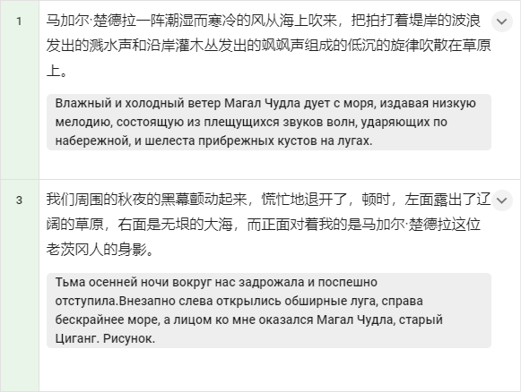
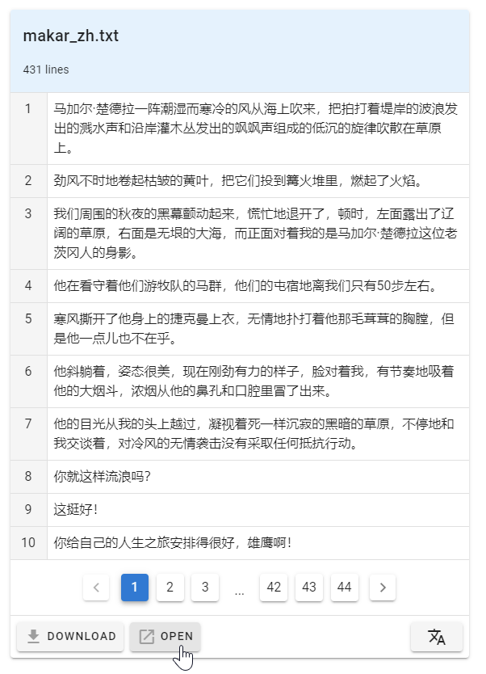
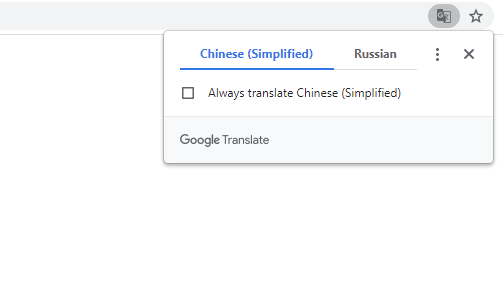
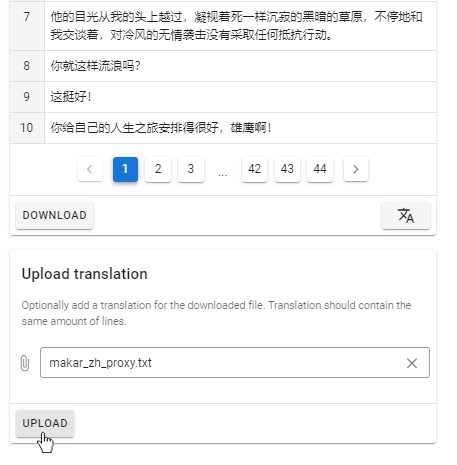
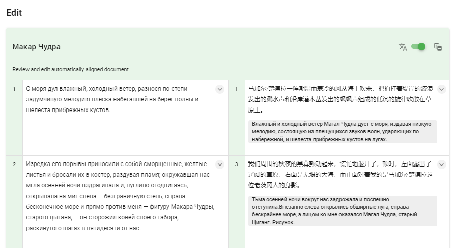

Вспомогательный перевод
=======================

.. raw:: html

  <iframe width="680" height="380" src="https://www.youtube.com/embed/k01P8YRDXzs?rel=0" frameborder="0" allowfullscreen></iframe>

     

Для удобства работы по желанию можно добавить к тексту на иностранном языке вспомогательный машинный перевод, который будет отображаться под каждой строкой текста в области редактирования.

Варианты создания перевода
--------------------------

Первый вариант
^^^^^^^^^^^^^^

Чтобы создать файл со вспомогательным переводом, перейдите к секции Preview и скачайте текст на иностранном языке с помощью кнопки Download. Обратите внимание: в отличие от исходного файла текст в скачанном документе разбит по строкам. Переведите текст с помощью любого из доступных Вам сервисов или программ машинного перевода (например, Google Переводчик) и сохраните в формате txt; убедитесь, что разбиение по строкам сохранилось.

Второй вариант
^^^^^^^^^^^^^^

Также можно воспользоваться встроенным в браузер Chrome переводчиком сайтов. Для этого нажмите на кнопку Open, при этом текст откроется в браузере без скачивания (это важно так как Chrome не позволяет переводить локальные файлы).

Chrome предложит перевести страницу на русский язык. Переведенный текст нужно сохранить к себе на компьютер и перейти к следующему шагу.

Загрузка перевода
-----------------

Для загрузки вспомогательного перевода нажмите кнопку **Add translation hint** под текстом в секции Preview. Откроется область Upload translation; выберите файл с переводом, нажав на значок скрепки, после чего нажмите кнопку Upload.

Затем создайте выравнивание как обычно. После выравнивания первой части текста в области редактирования Edit необходимо передвинуть ползунок вправо. Вспомогательный перевод появится под строками иностранного текста. Отключить вспомогательный перевод можно в любой момент, передвинув ползунок влево.

Обратите внимание, что файл со вспомогательным переводом необходимо загрузить до начала выравнивания.
