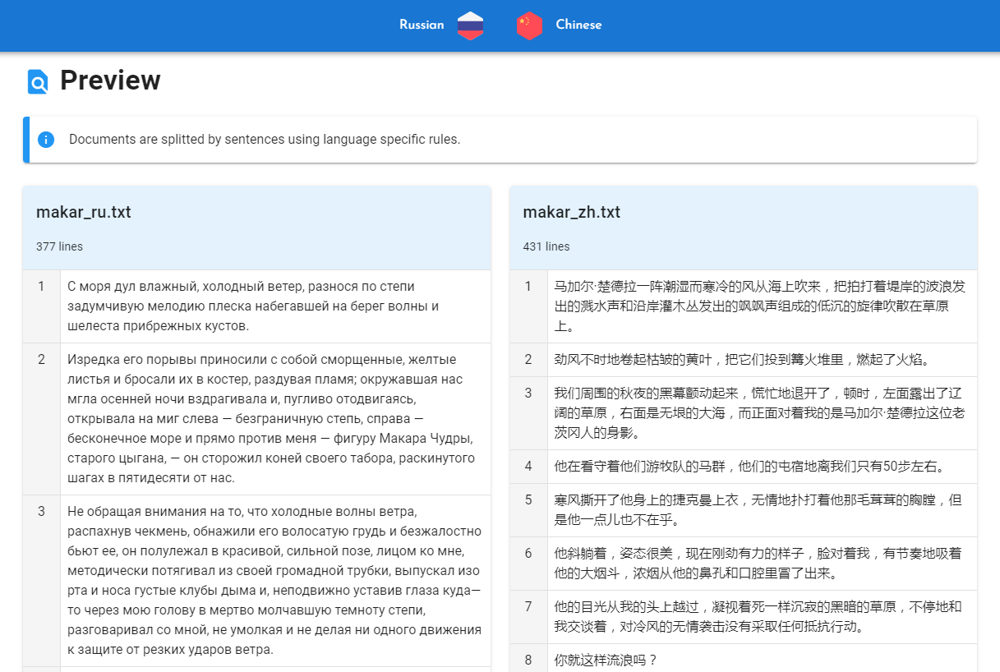
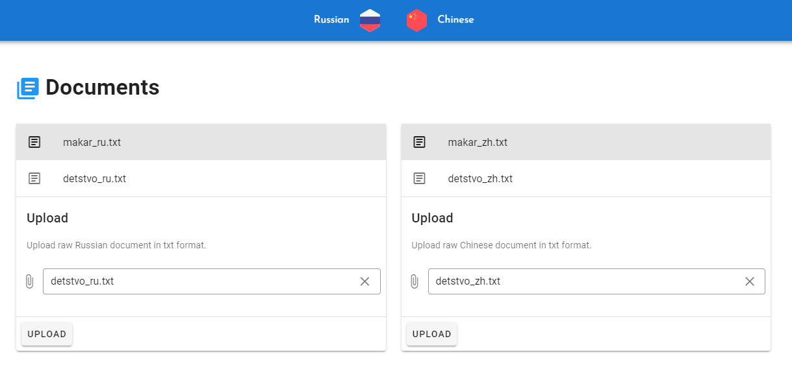
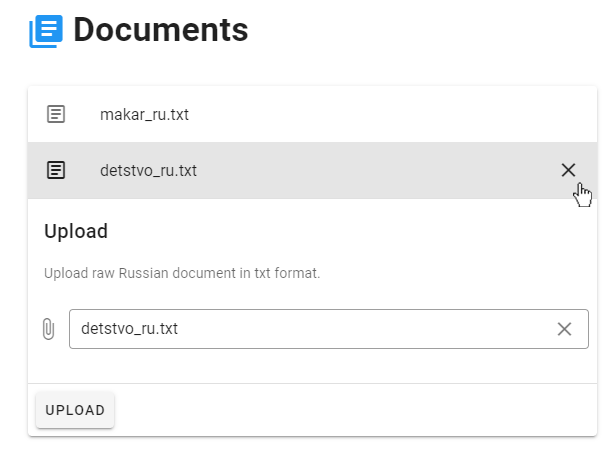

Загрузка документов
===================

.. raw:: html

  <iframe width="680" height="380" src="https://www.youtube.com/embed/NbEB9l8IQp8?rel=0" frameborder="0" allowfullscreen></iframe>

     

Выбор языка
-----------

Перед загрузкой выберите языки из раскрывающегося списка на панели в верхней части приложения. Затем, щелкнув на скрепку, выберите нужный файл и нажмите кнопку Upload. После успешной загрузки название файла появится в верхней части секции. Убедитесь, что язык документа соответствует языку, выбранному на верхней панели. Повторите процедуру для второго документа.

Загрузка
--------

Рекомендуется загружать текст на исходном языке в левую колонку, а текст на языке перевода – в правую, так как программа берет за основу предложения именно из левой колонки и подбирает к ним наиболее подходящие по смыслу из правой. К примеру, для выравнивания рассказа Максима Горького «Макар Чудра» и его перевода на китайский язык нужно загрузить текст на русском языке в левую колонку, а текст на китайском – в правую.

В каждую из колонок можно загрузить несколько документов. Названия загруженных файлов будут появляться в верхней части секции, а выбранный документ – подсвечиваться серым. Для выбора нужного документа из списка загруженных достаточно просто щелкнуть по нему. При одновременной работе с несколькими документами перед созданием выравнивания убедитесь, что файлы выбраны правильно.

Удаление документов
-------------------

Для того, чтобы удалить загруженный документ, нужно нажать на значок крестика, который появляется при наведении курсора на название файла.

Обратите внимание: после загрузки документы закрепляются за выбранными на верхней панели языкам. Если после загрузки документов Вы обнаружили, что неправильно установили языки, удалите загруженные файлы, выберите языки правильно и загрузите документы заново.

.. :ref:`Upload documents <ui-upload>`.
